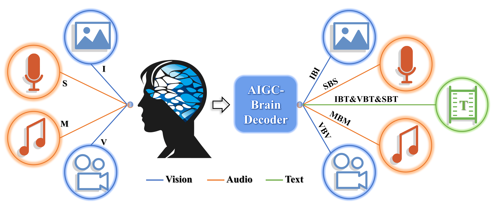

# AIGC-Brain
#### Brain-Conditional Multimodal Synthesis: A Survey and Taxonomy

[//]: # (Generative AI in Non-Invasive Brain Perception Decoding: A Survey and Taxonomy)
<!-- !# <p align=center> AIGC in Non-Invasive Brain Decoding: <br> A Survey and Taxonomy</p> -->
[//]: # ()

<br>

[](https://arxiv.org/abs/2112.13592)
[](https://github.com/sindresorhus/awesome) 
[](https://GitHub.com/Naereen/StrapDown.js/graphs/commit-activity) 
[](http://makeapullrequest.com) 
[](https://github.com/Naereen/StrapDown.js/blob/master/LICENSE)
<!-- [](http://commonmark.org) -->
<!-- [](http://ansicolortags.readthedocs.io/?badge=latest) -->
<be>

<br>
Generative AI (AIGC, a.k.a AI-generated content) in Brain-Conditional Multimodal Synthesis. Sensory perception including visual stimuli (image (I) and video (V)) and audio stimuli (music (M) and speech/sound (S)) from the external world is converted into neural signals (EEG, fMRI, or MEG). The AIGC-Brain decoder decodes brain signals for various tasks, i.e., Image-Brain-Image (IBI), Video-Brain-Video (VBV), Sound-Brain-Sound (SBS), Music-Brain-Music (MBM), Image-Brain-Text (IBT), Video-Brain-Text (VBT), and Speech-Brain-Text (SBT).
<br>

This project is associated with our survey paper which comprehensively contextualizes the advance of AIGC in Non-invasive Brain Decoding by formulating taxonomies according to model architectures and AIGC-Brain tasks.


[//]: # ( **Multimodal Image Synthesis and Editing: The Generative AI Era [[Paper]&#40;https://arxiv.org/abs/2112.13592&#41;]  [[Project]&#40;https://fnzhan.com/Generative-AI/&#41;]**  <br>)

[//]: # ([Fangneng Zhan]&#40;https://fnzhan.com/&#41;, [Yingchen Yu]&#40;https://yingchen001.github.io/&#41;, [Rongliang Wu]&#40;https://scholar.google.com.sg/citations?user=SZkh3iAAAAAJ&hl=en&#41;, [Jiahui Zhang]&#40;https://scholar.google.com/citations?user=DXpYbWkAAAAJ&hl=zh-CN&#41;, [Shijian Lu]&#40;https://scholar.google.com.sg/citations?user=uYmK-A0AAAAJ&hl=en&#41;, [Lingjie Liu]&#40;https://lingjie0206.github.io/&#41;, [Adam Kortylewsk]&#40;https://generativevision.mpi-inf.mpg.de/&#41;, <br> [Christian Theobalt]&#40;https://people.mpi-inf.mpg.de/~theobalt/&#41;, [Eric Xing]&#40;http://www.cs.cmu.edu/~epxing/&#41; <br>)

[//]: # (*IEEE Transactions on Pattern Analysis and Machine Intelligence &#40;TPAMI&#41;, 2023*)

[//]: # ()
[//]: # (<!---[DeepAI]&#40;https://deepai.org/publication/multimodal-image-synthesis-and-editing-a-survey&#41;.**-->)

[//]: # ()
[//]: # (<br>)

[//]: # ()
[//]: # ([![PR's Welcome]&#40;https://img.shields.io/badge/PRs-welcome-brightgreen.svg?style=flat&#41;]&#40;http://makeapullrequest.com&#41; )

[//]: # (You are welcome to promote papers via pull request. <br>)

[//]: # (The process to submit a pull request:)

[//]: # (- a. Fork the project into your own repository.)

[//]: # (- b. Add the Title, Author, Conference, Paper link, Project link, and Code link in `README.md` with below format:)

[//]: # (```)

[//]: # (**Title**<br>)

[//]: # (*Author*<br>)

[//]: # (Conference)

[//]: # ([[Paper]&#40;Paper link&#41;])

[//]: # ([[Code]&#40;Project link&#41;])

[//]: # ([[Project]&#40;Code link&#41;])

[//]: # (```)

[//]: # (- c. Submit the pull request to this branch.)

[//]: # ()
[//]: # (<br>)


**Methods:**
<!-- ### Methods: -->
- [Image-Brain-Image (Image-Reconstruction)](#image-brain-image-image-reconstruction)
- [Image-Brain-Text (Image-Cpationing)](#image-brain-text-image-captioning)
- [Image-Brain-Image & Image-Brain-Text (Image Reconstruction & Captioning)](#image-brain-image--image-brain-text)
- [Video-Brain-Video (Video-Reconstruction)](#video-brain-video-video-reconstruction)
- [Video-Brain-Text (Video-Captioning)](#video-brain-text-video-captioning)
- [Speech-Brain-Speech (Speech-Reconstruction)](#speech-brain-speech-speech-reconstruction)
- [Speech-Brain-Text (Semantic-Reconstruction)](#speech-brain-text-semantic-reconstruction)
- [Music-Brain-Music (Music-Reconstruction)](#music-brain-music-music-reconstruction)
- [Imagery](#imagery)


## Image-Brain-Image (Image-Reconstruction)

### fMRI
**DREAM: Visual Decoding from Reversing Human Visual System**<br>
*Weihao Xia, Raoul de Charette, Cengiz Öztireli, Jing-Hao Xue*<br>
arXiv 2023.10
[[Paper](https://arxiv.org/abs/2310.02265)]
[[Project](https://weihaox.github.io/DREAM/)] <br>
Dataset [[NSD](#fmri-image)] <br>
<font color=#FF0000 >(New) Diffusion (Mapping) + CNN(RGBD) + Contrastive(CLIP)</font> 

**(BrainSD) High-resolution image reconstruction with latent diffusion models from human brain activity**<br>
*Yu Takagi,  Shinji Nishimoto*<br>
CVPR 2023
[[Paper](https://www.biorxiv.org/content/10.1101/2022.11.18.517004v3)]
[[Code](https://github.com/yu-takagi/StableDiffusionReconstruction)]
[[Project](https://sites.google.com/view/stablediffusion-with-brain/)] <br>
Dataset [[NSD](#fmri-image)] <br>
<font color=#FF0000 >Text-Conditional Diffusion + Ridge Regression(Mapping)</font> 

**(BrainSD-TGD) Improving visual image reconstruction from human brain activity using latent diffusion models via multiple decoded inputs**<br>
*Yu Takagi,  Shinji Nishimoto*<br>
arxiv 2023
[[Paper](https://arxiv.org/abs/2306.11536)]
[[Code](https://github.com/yu-takagi/StableDiffusionReconstruction)]
[[Project](https://sites.google.com/view/stablediffusion-with-brain/)] <br>
Dataset [[NSD](#fmri-image)] <br>
<font color=#FF0000 >Text-Conditional Diffusion (Mapping)</font>

**(BrainDiffuser) Natural scene reconstruction from fMRI signals using generative latent diffusion**<br>
*Furkan Ozcelik, Rufin VanRullen*<br>
Scientific Reports 2023
[[Paper](https://www.nature.com/articles/s41598-023-42891-8)]
[[Code](http://github.com/ozcelikfu/brain-diffuser)] <br>
Dataset [[NSD](#fmri-image)] <br>
<font color=#FF0000 >Text&Image-Conditional Diffusion (Mapping)</font>

**MindDiffuser: Controlled Image Reconstruction from Human Brain Activity with Semantic and Structural Diffusion**<br>
*Yizhuo Lu, Changde Du, Dianpeng Wang, Huiguang He*<br>
ACM MM 2023
[[Paper](https://arxiv.org/abs/2303.14139)]
[[Code](https://github.com/ReedOnePeck/MindDiffuser)] <br>
Dataset [[NSD](#fmri-image)]<br>
<font color=#FF0000 >Diffusion (Mapping)</font>

**Mind Reader: Reconstructing complex images from brain activities**<br>
*Sikun Lin, Thomas Sprague, Ambuj K Singh*<br>
NeurIPS 2022
[[Paper](https://proceedings.neurips.cc/paper_files/paper/2022/hash/bee5125b773414d3d6eeb4334fbc5453-Abstract-Conference.html)]
[[Code](https://github.com/sklin93/mind-reader)] <br>
Dataset [[NSD](#fmri-image)]<br>
<font color=#FF0000 >StyleGAN2 (Mapping)</font>

**(MindEye) Reconstructing the Mind's Eye: fMRI-to-Image with Contrastive Learning and Diffusion Priors**<br>
*Paul S. Scotti, Atmadeep Banerjee, Jimmie Goode, Stepan Shabalin, Alex Nguyen, Ethan Cohen, Aidan J. Dempster, Nathalie Verlinde, Elad Yundler, David Weisberg, Kenneth A. Norman, Tanishq Mathew Abraham*<br>
arxiv 2023
[[Paper](https://arxiv.org/abs/2305.18274)]
[[Code](https://github.com/MedARC-AI/fMRI-reconstruction-NSD)]
[[Project](https://medarc-ai.github.io/mindeye/)] <br>
Dataset [[NSD](#fmri-image)]<br>
<font color=#FF0000 >Diffusion (Mapping)</font>

**BrainCLIP: Bridging Brain and Visual-Linguistic Representation Via CLIP for Generic Natural Visual Stimulus Decoding**<br>
*Yulong Liu, Yongqiang Ma, Wei Zhou, Guibo Zhu, Nanning Zheng*<br>
arxiv 2023
[[Paper](https://arxiv.org/abs/2302.12971)]
[[Code](https://github.com/YulongBonjour/BrainCLIP)] <br>
Dataset [[NSD](#fmri-image)] [[GOD](#fmri-image)]<br>
<font color=#FF0000 >Diffusion (Mapping)</font>


**(SBN-ICGAN) Decoding natural image stimuli from fMRI data with a surface-based convolutional network**<br>
*Zijin Gu, Keith Jamison, Amy Kuceyeski, Mert Sabuncu*<br>
MIDL 2023
[[Paper](https://arxiv.org/abs/2212.02409)]
[[Code](https://github.com/zijin-gu/meshconv-decoding)] <br>
Dataset [[NSD](#fmri-image)]<br>
<font color=#FF0000 >IC-GAN + surface-based CNN (Mapping)</font>

--------------------------------------------------------------------------------------------------------

**(MindVis) Seeing Beyond the Brain: Conditional Diffusion Model with Sparse Masked Modeling for Vision Decoding**<br>
*Zijiao Chen, Jiaxin Qing, Tiange Xiang, Wan Lin Yue, Juan Helen Zhou*<br>
CVPR 2023
[[Paper](https://arxiv.org/abs/2211.06956)]
[[Code](https://github.com/zjc062/mind-vis)]
[[Project](https://mind-vis.github.io/)] <br>
Dataset [[HCP](#fmri-pretrain)]  [[GOD](#fmri-image)]  [[BLOD5000](#fmri-image)] <br>
<font color=#FF0000 >MAE (Pretrain) + Stable Diffusion (Finetune)</font>

**(DBDM) Dual-Guided Brain Diffusion Model: Natural Image Reconstruction from Human Visual Stimulus fMRI**<br>
*Lu Meng, Chuanhao Yang*<br>
Bioengineering 2023
[[Paper](https://www.mdpi.com/2306-5354/10/10/1117)]
Dataset [[GOD](#fmri-image)]<br>
<font color=#FF0000 >New</font>

**(VQ-VAE) Rethinking Visual Reconstruction: Experience-Based Content Completion Guided by Visual Cues**<br>
*Jiaxuan Chen, Yu Qi, Gang Pan*<br>
ICML 2023
[[Paper](https://openreview.net/forum?id=l3sdNQdmQh)] <br>
Dataset [[GOD](#fmri-image)] <br>
<font color=#FF0000 >VQ-VAE</font>

**(H-VAE) Generative Decoding of Visual Stimuli**<br>
*Eleni Miliotou, Panagiotis Kyriakis, Jason D Hinman, Andrei Irimia, Paul Bogdan*<br>
ICML 2023
[[Paper](https://openreview.net/forum?id=57OuafQmu8)] <br>
Dataset [[GOD](#fmri-image)] <br>
<font color=#FF0000 >Hierarchical VAE</font>

**(IC-GAN) Reconstruction of Perceived Images from fMRI Patterns and Semantic Brain Exploration using Instance-Conditioned GANs**<br>
*Furkan Ozcelik, Bhavin Choksi, Milad Mozafari, Leila Reddy, Rufin VanRullen*<br>
IJCNN 2022
[[Paper](https://ieeexplore.ieee.org/abstract/document/9892673)]
[[Code](https://github.com/ozcelikfu/IC-GAN_fMRI_Reconstruction)] <br>
Dataset [[GOD](#fmri-image)]<br>
<font color=#FF0000 >IC-GAN + Ridge Regression (Mapping)</font>

**(HS-GAN) Semantics-guided hierarchical feature encoding generative adversarial network for natural image reconstruction from brain activities**<br>
*Lu Meng, Chuanhao Yang*<br>
IJCNN 2023
[[Paper](https://ieeexplore.ieee.org/abstract/document/10191903)] <br>
Dataset [[GOD](#fmri-image)]<br>
<font color=#FF0000 >Hierarchical-Semantic GAN + Lightweight DNN (Mapping)</font>


**(SBD) Semantic Brain Decoding: from fMRI to conceptually similar image reconstruction of visual stimuli**<br>
*Matteo Ferrante, Tommaso Boccato, Nicola Toschi*<br>
arxiv 2023
[[Paper](https://arxiv.org/abs/2212.06726)] 
[[Code](https://github.com/matteoferrante/semantic-brain-decoding)] <br>
Dataset [[GOD](#fmri-image)]<br>
<font color=#FF0000 >Class-Conditional Diffusion + Ridge Regression (Mapping)</font>

**(LEA) Joint fMRI Decoding and Encoding with Latent Embedding Alignment**<br>
*Xuelin Qian, Yikai Wang, Yanwei Fu, Xinwei Sun, Xiangyang Xue, Jianfeng Feng*<br>
arxiv 2023
[[Paper](https://arxiv.org/abs/2303.14730)] <br>
Dataset [[HCP](#fmri-pretrain)]  [[GOD](#fmri-image)]  [[BLOD5000](#fmri-image)]<br>
<font color=#FF0000 >MAE (pretrain) + CLIP-Image & Class-Conditional MaskGit (Masked generative image transformer) + Ridge Regression (Mapping)</font>

**(CMVDM) Controllable Mind Visual Diffusion Model**<br>
*Bohan Zeng, Shanglin Li, Xuhui Liu, Sicheng Gao, Xiaolong Jiang, Xu Tang, Yao Hu, Jianzhuang Liu, Baochang Zhang*<br>
arxiv 2023
[[Paper](https://arxiv.org/abs/2305.10135)] <br>
Dataset [[HCP](#fmri-pretrain)]  [[GOD](#fmri-image)]  [[BLOD5000](#fmri-image)]<br>
<font color=#FF0000 >MAE (pretrain) + Diffusion (Finetune) + ControlNet</font>

**(CAD) Contrast, Attend and Diffuse to Decode High-Resolution Images from Brain Activities**<br>
*Jingyuan Sun, Mingxiao Li, Zijiao Chen, Yunhao Zhang, Shaonan Wang, Marie-Francine Moens*<br>
arxiv 2023
[[Paper](https://arxiv.org/abs/2305.17214)] <br>
Dataset [[HCP](#fmri-pretrain)]  [[GOD](#fmri-image)]  [[BLOD5000](#fmri-image)]<br>
<font color=#FF0000 >Double-contrastive MAE (pretrain) + Cross Modality Attention + Diffusion (Fix) & MAE (Finetune)</font>

**(SS-NIR) From voxels to pixels and back: Self-supervision in natural-image reconstruction from fMRI**<br>
*Roman Beliy, Guy Gaziv, Assaf Hoogi, Francesca Strappini, Tal Golan, Michal Irani*<br>
NeurIPS 2019
[[Paper](https://proceedings.neurips.cc/paper_files/paper/2019/hash/7d2be41b1bde6ff8fe45150c37488ebb-Abstract.html)]
[[Project](https://www.wisdom.weizmann.ac.il/~vision/ssfmri2im/)] <br>
[[Code](https://github.com/WeizmannVision/ssfmri2im)] <br>
Dataset [[GOD](#fmri-image)] [[Vim-1](#fmri-image)]<br>
<font color=#FF0000 >CNN-Based Encoder-Decoder</font>

**(RGBD) More Than Meets the Eye: Self-Supervised Depth Reconstruction From Brain Activity**<br>
*Guy Gaziv, Michal Irani*<br>
arXiv 2021
[[Paper](https://arxiv.org/abs/2106.05113)]
[[Code](https://github.com/WeizmannVision/SelfSuperReconst)] <br>
Dataset [[GOD](#fmri-image)] [[Vim-1](#fmri-image)]<br>
<font color=#FF0000 >CNN-Based Encoder-Decoder</font>

**(SS-NIR2) Self-supervised Natural Image Reconstruction and Large-scale Semantic Classification from Brain Activity**<br>
*Guy Gaziv, Roman Beliy, Niv Granot, Assaf Hoogi, Francesca Strappini, Tal Golan, Michal Irani*<br>
NeuroImage 2022
[[Paper](https://www.sciencedirect.com/science/article/pii/S105381192200249X)]
[[Code](https://github.com/WeizmannVision/SelfSuperReconst)] <br>
Dataset [[GOD](#fmri-image)] [[Vim-1](#fmri-image)]<br>
<font color=#FF0000 >CNN-Based Encoder-Decoder</font>

**(SS-GAN) Reconstructing Perceptive Images from Brain Activity by Shape-Semantic GAN**<br>
*Tao Fang, Yu Qi, Gang Pan*<br>
NeurIPS 2020
[[Paper](https://proceedings.neurips.cc/paper/2020/hash/9813b270ed0288e7c0388f0fd4ec68f5-Abstract.html)]
[[Code](https://github.com/duolala1/Reconstructing-Perceptive-Images-from-Brain-Activity-by-Shape-Semantic-GAN)] <br>
Dataset [[GOD](#fmri-image)]]<br>
<font color=#FF0000 >GAN (Image-to-Image Translation: Image-to-image translation with conditional adversarial networks) + Linear (Low-Mapping) + DNN (High-Mapping)</font>

**(BigBiGAN) Reconstructing Natural Scenes from fMRI Patterns using BigBiGAN**<br>
*Milad Mozafari, Leila Reddy, Rufin VanRullen*<br>
IJCNN 2020
[[Paper](https://ieeexplore.ieee.org/abstract/document/9206960)] <br>
Dataset [[GOD](#fmri-image)] <br>
<font color=#FF0000 >BigBiGAN + Linear Regression (Mapping)</font>

**(D-VAE-GAN) Reconstructing seen image from brain activity by visually-guided cognitive representation and adversarial learning**<br>
*Ziqi Ren, Jie Li, Xuetong Xue, Xin Li, Fan Yang, Zhicheng Jiao, Xinbo Gao*<br>
NeuroImage 2021
[[Paper](https://www.sciencedirect.com/science/article/pii/S1053811920310879)] <br>
Dataset [[GOD](#fmri-image)] [[BRAINS](#fmri-image)] [[BCP](#fmri-image)] [[6-9](#fmri-image)]<br>
<font color=#FF0000 >Dual-VAE + GAN</font>

**(DC-GAN) Generative adversarial networks for reconstructing natural images from brain activity**<br>
*K. Seeliger, U. Güçlü, L. Ambrogioni, Y. Güçlütürk, M.A.J. van Gerven*<br>
NeuroImage 2018
[[Paper](https://www.sciencedirect.com/science/article/pii/S105381191830658X)]
[[Code](https://github.com/seelikat/ganrecon)] <br>
Dataset [[GOD](#fmri-image)] [[Vim-1](#fmri-image)] [[BRAINS](#fmri-image)]<br>
<font color=#FF0000 >Deep Convolutional GAN + Linear Regression (Mapping)</font>

----------------------------------------------------------------------------------------------------

**(Dataset&Method) Deep image reconstruction from human brain activity**<br>
*Guohua Shen, Tomoyasu Horikawa, Kei Majima, Yukiyasu Kamitani*<br>
PLOS Computational Biology 2019
[[Paper](https://journals.plos.org/ploscompbiol/article?id=10.1371/journal.pcbi.1006633)]
[[Code](https://github.com/KamitaniLab/DeepImageReconstruction)]<br>
<font color=#FF0000 >GAN + Sparse Linear Regression (Mapping)</font>

**(E-DIR) End-to-End Deep Image Reconstruction From Human Brain Activity**<br>
*Guohua Shen, Kshitij Dwivedi, Kei Majima, Tomoyasu Horikawa, Yukiyasu Kamitani*<br>
Frontiers in Computational Neuroscience 2019
[[Paper](https://www.frontiersin.org/articles/10.3389/fncom.2019.00021/full)] <br>
Dataset [[DIR](#fmri-image)]<br>
<font color=#FF0000 >GAN</font>

**(Reponse and Imagery) Mental image reconstruction from human brain activity**<br>
*Naoko Koide-Majima, Shinji Nishimoto, Kei Majima*<br>
bioRxiv 2023
[[Paper](https://www.biorxiv.org/content/10.1101/2023.01.22.525062v2.abstract)]
[[Code](https://github.com/nkmjm/mental_img_recon)] <br>
Dataset [[DIR](#fmri-image)] <br>
<font color=#FF0000 >Non-Generative (Bayesian estimation)</font>

-----------------------------------------------------------------------------------------

**(BigGAN) BigGAN-based Bayesian Reconstruction of Natural Images from Human Brain Activity**<br>
*Kai Qiao, Jian Chen, Linyuan Wang, Chi Zhang, Li Tong, Bin Yan*<br>
Neuroscience 2020
[[Paper](https://www.sciencedirect.com/science/article/pii/S0306452220304814)] <br>
Dataset [[Vim-1](#fmri-image)] <br>
<font color=#FF0000 > BigGAN (Class-Conditional) + BLSTM (Mapping)</font>

**(Dataset&Method) Reconstructing faces from fMRI patterns using deep generative neural networks**<br>
*Rufin VanRullen, Leila Reddy*<br>
Communications Biology 2019
[[Paper](https://www.nature.com/articles/s42003-019-0438-y)]
[[Code](https://github.com/rufinv/VAE-GAN-celebA)] <br>
Dataset [[Face](#fmri-image)]<br>
<font color=#FF0000 >VAE-GAN + Linear Regression (Mapping)</font>

-----------------------------------------------------------------------------------------------------

### EEG
**DreamDiffusion: Generating High-Quality Images from Brain EEG Signals**<br>
*Yunpeng Bai, Xintao Wang, Yan-pei Cao, Yixiao Ge, Chun Yuan, Ying Shan*<br>
arxiv 2023
[[Paper](https://arxiv.org/abs/2306.16934)]
[[Code](https://github.com/bbaaii/DreamDiffusion)] <br>
Dataset [[EEG-ImageNet](#eeg-image)] <br>
<font color=#FF0000 >MAE (Pretrain) + Diffusion (Finetune) + CLIP-Image (Mapping)</font>

**(NeuroImagen) Seeing through the Brain: Image Reconstruction of Visual Perception from Human Brain Signals**<br>
*Yu-Ting Lan, Kan Ren, Yansen Wang, Wei-Long Zheng, Dongsheng Li, Bao-Liang Lu, Lili Qiu*<br>
arxiv 2023
[[Paper](https://arxiv.org/abs/2308.02510)] <br>
Dataset [[EEG-ImageNet](#eeg-image)]<br>
<font color=#FF0000 >Diffusion + CLIP-Text (Mapping) + Low-level Image (Mapping) </font>

**DM-RE2I: A framework based on diffusion model for the reconstruction from EEG to image**<br>
*Hong Zeng, Nianzhang Xia, Dongguan Qian, Motonobu Hattori, Chu Wang, Wanzeng Kong*<br>
BSPC 2023
[[Paper](https://www.sciencedirect.com/science/article/pii/S174680942300558X)] <br>
Dataset [[EEG-ImageNet](#eeg-image)]<br>
<font color=#FF0000 >Diffusion + EVRNet (Semantic Feature)</font>

**Brain2Image: Converting Brain Signals into Images**<br>
*Isaak Kavasidis, Simone Palazzo, Concetto Spampinato, Daniela Giordano, Mubarak Shah*<br>
ACM MM 2017
[[Paper](https://www.sciencedirect.com/science/article/pii/S174680942300558X)] <br>
Dataset [[EEG-ImageNet](#eeg-image)]<br>
<font color=#FF0000 >VAE/GAN + LSTM (Semantic Feature)</font>

**NeuroVision: perceived image regeneration using cProGAN**<br>
*Sanchita Khare, Rajiv Nayan Choubey, Loveleen Amar, Venkanna Udutalapalli*<br>
Neural Computing and Applications 2022
[[Paper](https://link.springer.com/article/10.1007/s00521-021-06774-1)] <br>
Dataset [[EEG-ImageNet](#eeg-image)]<br>
<font color=#FF0000 >Conditional ProGAN + LSTM&GRU (Semantic Feature)</font>

**(VG-GAN) Decoding EEG by Visual-guided Deep Neural Networks**<br>
*Zhicheng Jiao, Haoxuan You, Fan Yang, Xin Li, Han Zhang, Dinggang Shen*<br>
IJCAI 2019
[[Paper](https://www.ijcai.org/proceedings/2019/192)] <br>
Dataset [[EEG-ImageNet](#eeg-image)]<br>
<font color=#FF0000 >Visual-Guided GAN + CNN (Semantic Feature)</font>

**(EEG-GAN) Generative Adversarial Networks Conditioned by Brain Signals**<br>
*Simone Palazzo, Concetto Spampinato, Isaak Kavasidis, Daniela Giordano, Mubarak Shah*<br>
ICCV 2017
[[Paper](https://openaccess.thecvf.com/content_iccv_2017/html/Palazzo_Generative_Adversarial_Networks_ICCV_2017_paper.html)] <br>
Dataset [[EEG-ImageNet](#eeg-image)]<br>
<font color=#FF0000 >Conditional GAN + LSTM (Semantic Feature)</font>

--------------------------------------------------------------------------------------

### MEG
**BRAIN DECODING: TOWARD REAL-TIME RECONSTRUCTION OF VISUAL PERCEPTION**<br>
*Yohann Benchetrit1, Hubert Banville1, Jean-Remi King*<br>
arXiv 2023
[[Paper](https://arxiv.org/abs/2310.19812)] <br>
Dataset [[Things-MEG](#meg-image)]<br>
<font color=#FF0000 >Diffusion</font>

## Image-Brain-Text (Image-Captioning)

### fMRI
**DreamCatcher: Revealing the Language of the Brain with fMRI using GPT Embedding**<br>
*Subhrasankar Chatterjee, Debasis Samanta*<br>
arxiv 2023
[[Paper](https://arxiv.org/abs/2306.10082)] <br>
Dataset [[NSD](#fmri-image)]<br>
<font color=#FF0000 >LSTM</font>

**(Ridge-LSTM) Generation of Viewed Image Captions From Human Brain Activity Via Unsupervised Text Latent Space**<br>
*Saya Takada, Ren Togo, Takahiro Ogawa, Miki Haseyama*<br>
ICIP 2020
[[Paper](https://ieeexplore.ieee.org/abstract/document/9191262)] <br>
Dataset [[GOD](#fmri-image)]<br>
<font color=#FF0000 >LSTM + Ridge Regression</font>

**(PT-LDM) A neural decoding algorithm that generates language from visual activity evoked by natural images**<br>
*Wei Huang, Hongmei Yan, Kaiwen Cheng et al.*<br>
Neural Networks 2021
[[Paper](https://www.sciencedirect.com/science/article/pii/S0893608021003117)] <br>
Dataset [[OCE](#fmri-image)]<br>
<font color=#FF0000 >CNN-LSTM + GRU</font>

**(CNN-Transformer) A CNN-transformer hybrid approach for decoding visual neural activity into text**<br>
*Jiang Zhang, Chen Li, Ganwanming Liu et al.*<br>
Computer Methods and Programs in Biomedicine 2022
[[Paper](https://www.sciencedirect.com/science/article/pii/S016926072100660X)] <br>
Dataset [[OCE](#fmri-image)]<br>
<font color=#FF0000 >CNN + Transformer</font>

**Describing Semantic Representations of Brain Activity Evoked by Visual Stimuli**<br>
*Subhrasankar Chatterjee, Debasis Samanta*<br>
ICSMC 2018
[[Paper](https://ieeexplore.ieee.org/abstract/document/8616103)] <br>
Dataset [[Nishimoto](#fmri-video)]<br>
<font color=#FF0000 >LSTM + RidgeRegression/NN (Mapping)</font>

**Generating Natural Language Descriptions for Semantic Representations of Human Brain Activity**<br>
*Eri Matsuo, Ichiro Kobayashi, Shinji Nishimoto, Satoshi Nishida, Hideki Asoh*<br>
ACL 2016 student research workshop 2016
[[Paper](https://aclanthology.org/P16-3004/)] <br>
Dataset [[Nishimoto](#fmri-video)]<br>
<font color=#FF0000 >LSTM + RidgeRegression/NN (Mapping)</font>

--------------------------------------------------------------------------------------------

## Image-Brain-Image & Image-Brain-Text
**UniBrain: Unify Image Reconstruction and Captioning All in One Diffusion Model from Human Brain Activity**<br>
*Weijian Mai, Zhijun Zhang*<br>
arxiv 2023
[[Paper](https://arxiv.org/abs/2308.07428)] <br>
Dataset [[NSD](#fmri-image)]<br>
<font color=#FF0000 >Diffusion + Ridge Regression (Mapping)</font>

**Brain Captioning: Decoding human brain activity into images and text**<br>
*Matteo Ferrante, Furkan Ozcelik, Tommaso Boccato, Rufin VanRullen, Nicola Toschi*<br>
arxiv 2023
[[Paper](https://arxiv.org/abs/2305.11560)] <br>
Dataset [[NSD](#fmri-image)]<br>
<font color=#FF0000 >Generative Image-to-text Transformer (GIT) + Diffusion + ControlNet + Linear Regression (Mapping)</font>

--------------------------------------------------------------------------------------------

## Video-Brain-Video (Video-Reconstruction)

### fMRI
**Cinematic Mindscapes: High-quality Video Reconstruction from Brain Activity**<br>
*Zijiao Chen, Jiaxin Qing, Juan Helen Zhou*<br>
arxiv 2023
[[Paper](https://arxiv.org/abs/2305.11675)]
[[Code](https://github.com/jqin4749/MindVideo)]
[[Project](https://mind-video.com/)] <br>
Dataset [[Wen](#fmri-video)] [[HCP](#fmri-image)]<br>
<font color=#FF0000 >MAE (Pretrain) + CLIP-Image-Text (Contrastive-Align) + Diffusion (Finetune)</font>

**A Penny for Your (visual) Thoughts: Self-Supervised Reconstruction of Natural Movies from Brain Activity**<br>
*Ganit Kupershmidt, Roman Beliy, Guy Gaziv, Michal Irani*<br>
arxiv 2022
[[Paper](https://arxiv.org/abs/2206.03544)]
[[Project](https://www.wisdom.weizmann.ac.il/~vision/VideoReconstFromFMRI/)] <br>
Dataset [[Wen](#fmri-video)]<br>
<font color=#FF0000 >CNN-based Encoder-Decoder + Self-supervised</font>

**(f-CVGAN) Reconstructing rapid natural vision with fMRI-conditional video generative adversarial network**<br>
*Chong Wang, Hongmei Yan, Wei Huang, Jiyi Li, Yuting Wang, Yun-Shuang Fan, Wei Sheng, Tao Liu, Rong Li, Huafu Chen*<br>
Cerebral Cortex 2022
[[Paper](https://academic.oup.com/cercor/article-abstract/32/20/4502/6515038)] <br>
Dataset [[Wen](#fmri-video)] [[HCP](#fmri-pretrain)] <br>
<font color=#FF0000 >GAN</font>

**Variational autoencoder: An unsupervised model for encoding and decoding fMRI activity in visual cortex**<br>
*Kuan Han, Haiguang Wen, Junxing Shi, Kun-Han Lu, Yizhen Zhang, Di Fu, Zhongming Liu*<br>
NeuroImage 2019
[[Paper](https://www.sciencedirect.com/science/article/pii/S1053811919304318)] <br>
Dataset [[Wen](#fmri-video)]<br>
<font color=#FF0000 >VAE</font>

**Brain2Pix: Fully convolutional naturalistic video reconstruction from brain activity**<br>
*Lynn Le, Luca Ambrogioni, Katja Seeliger, Yağmur Güçlütürk, Marcel van Gerven, Umut Güçlü*<br>
Frontiers in Neuroscience 2022
[[Paper](https://www.frontiersin.org/articles/10.3389/fnins.2022.940972/full)]
[[Code](https://github.com/neuralcodinglab/brain2pix)] <br>
Dataset [[Seeliger](#fmri-video)]<br>
<font color=#FF0000 >GAN</font>

**(Dataset&Method) Neural Encoding and Decoding with Deep Learning for Dynamic Natural Vision**<br>
*Haiguang Wen, Junxing Shi, Yizhen Zhang, Kun-Han Lu, Jiayue Cao, Zhongming Liu*<br>
Cerebral Cortex 2018
[[Paper](https://academic.oup.com/cercor/article/28/12/4136/4560155)]
[[Data](https://purr.purdue.edu/publications/2809/1)] <br>
Dataset [[Wen](#fmri-video)]<br>

<font color=#FF0000 >Deconvolution</font>

-----------------------------------------------------------------------------------------

## Video-Brain-Text (Video-Captioning)
**(Dataset&Method) Semantic reconstruction of continuous language from non-invasive brain recordings**<br>
*Jerry Tang, Amanda LeBel, Shailee Jain, Alexander G. Huth*<br>
Nature Neuroscience 2023
[[Paper](https://www.nature.com/articles/s41593-023-01304-9)]
[[Code](https://github.com/HuthLab/semantic-decoding)]  <br>
Dataset [[Tang](#fmri-video-speech)] <br>
<font color=#FF0000 >GPT + Cross-Modal (transfer)</font>

**(Cross-Modal Decoding) Brain encoding models based on multimodal transformers can transfer across language and vision**<br>
*Jerry Tang, Meng Du, Vy A. Vo, Vasudev Lal, Alexander G. Huth*<br>
arxiv 2023
[[Paper](https://arxiv.org/abs/2305.12248)] <br>
Dataset [[Tang](#fmri-video-speech)]

--------------------------------------------------------------------------------------

## Speech-Brain-Speech (Speech-Reconstruction)
**(Dataset&Method) Sound reconstruction from human brain activity via a generative model with brain-like auditory features**<br>
*Jong-Yun Park, Mitsuaki Tsukamoto, Misato Tanaka, Yukiyasu Kamitani*<br>
arxiv 2023
[[Paper](https://arxiv.org/abs/2306.11629)] <br>
<font color=#FF0000 >Audio-Generative Transformer + Ridge Regression (Mapping)</font>

**(Dataset&Method) End-to-end translation of human neural activity to speech with a dual–dual generative adversarial network**<br>
*Yina Guo, Ting Liu, Xiaofei Zhang, Anhong Wang, Wenwu Wang*<br>
Knowledge-Based Systems 2023
[[Paper](https://www.sciencedirect.com/science/article/pii/S0950705123005877)]
[[Code](https://github.com/qwe1218088/dual-dualgan)] <br>
<font color=#FF0000 >Dual-DualGAN</font>

--------------------------------------------------------------------------------------

## Speech-Brain-Text (Semantic-Reconstruction)
**(Dataset&Method) Semantic reconstruction of continuous language from non-invasive brain recordings**<br>
*Jerry Tang, Amanda LeBel, Shailee Jain, Alexander G. Huth*<br>
Nature Neuroscience 2023
[[Paper](https://www.nature.com/articles/s41593-023-01304-9)]
[[Code](https://github.com/HuthLab/semantic-decoding)]  <br>
Dataset [[Tang](#fmri-video-speech)]<br>
<font color=#FF0000 >GPT + Word Rate + Beam Search + Ridge Regression</font>

**UniCoRN: Unified Cognitive Signal ReconstructioN bridging cognitive signals and human language**<br>
*Nuwa Xi, Sendong Zhao, Haochun Wang, Chi Liu, Bing Qin, Ting Liu*<br>
arxiv 2023
[[Paper](https://arxiv.org/abs/2307.05355)] <br>
Dataset [[Narratives](#fmri-speech)]<br>
<font color=#FF0000 >BART (Bidirectional and Auto-Regressive Transformers)</font>

----------------------------------------------------------------------------------------

## Music-Brain-Music (Music-Reconstruction)
**Brain2Music: Reconstructing Music from Human Brain Activity**<br>
*Timo I. Denk, Yu Takagi, Takuya Matsuyama, Andrea Agostinelli, Tomoya Nakai, Christian Frank, Shinji Nishimoto*<br>
arxiv 2023
[[Paper](https://arxiv.org/abs/2307.11078)]
[[Project](https://google-research.github.io/seanet/brain2music/)]
[[Data-MusicCaption](https://www.kaggle.com/datasets/nishimotolab/music-caption-brain2music)] <br>
Dataset [[MusicGenre](#fmri-music)]<br>
<font color=#FF0000 >MusicLM (SoundStream: CNN Encoder-Decoder with Residual Vector Quantizer (RVQ)</font>

**(Dataset&Method) Neural decoding of music from the EEG**<br>
*Ian Daly*<br>
Scientific Reports 2023
[[Paper](https://www.nature.com/articles/s41598-022-27361-x)] <br>
Dataset [[Daly](#fmri-eeg-music--eeg-music)]<br>
<font color=#FF0000 >B-LSTM</font>

-------------------------------------------------------------------------------

## Imagery
**Mental image reconstruction from human brain activity**<br>
*Naoko Koide-Majima, Shinji Nishimoto, Kei Majima*<br>
bioRxiv 2023
[[Paper](https://www.biorxiv.org/content/10.1101/2023.01.22.525062v2.abstract)]
[[Code](https://github.com/nkmjm/mental_img_recon)] <br>
Dataset [[DIR](#fmri-image)] <br>
<font color=#FF0000 >Non-Generative (Bayesian estimation)</font>

**ThoughtViz: Visualizing Human Thoughts Using Generative Adversarial Network**<br>
*Praveen Tirupattur, Yogesh Singh Rawat, Concetto Spampinato, Mubarak Shah*<br>
ACM MM 2018
[[Paper](https://dl.acm.org/doi/10.1145/3240508.3240641)] <br>
Dataset [[EEG-Imagery](#eeg-image)]<br>
<font color=#FF0000 >GAN + CNN (Senmatic Feature)</font>

**NeuroGAN: image reconstruction from EEG signals via an attention-based GAN**<br>
*Rahul Mishra, Krishan Sharma, R. R. Jha, Arnav Bhavsar*<br>
Neural Computing and Applications 2023
[[Paper](https://link.springer.com/article/10.1007/s00521-022-08178-1)] <br>
Dataset [[EEG-Imagery](#eeg-image)]<br>
<font color=#FF0000 >GAN</font>

**EEG2IMAGE: Image Reconstruction from EEG Brain Signals**<br>
*Prajwal Singh, Pankaj Pandey, Krishna Miyapuram, Shanmuganathan Raman*<br>
ICASSP 2023
[[Paper](https://arxiv.org/abs/2302.10121)]
[[Code](https://github.com/prajwalsingh/EEG2Image)] <br>
Dataset [[EEG-Imagery](#eeg-image)]<br>
<font color=#FF0000 >GAN + LSTM (Senmatic Feature)</font>

------------------------------------------------------------------------------------

## Neuroimaging Dataset

### fMRI-Pretrain
**(HCP) The WU-Minn Human Connectome Project: An overview**<br>
*David C. Van Essen a, Stephen M. Smith b, Deanna M. Barch c, Timothy E.J. Behrens b, Essa Yacoub d, Kamil Ugurbil d, for the WU-Minn HCP Consortium*<br>
NeuroImage 2013
[[Paper](https://www.sciencedirect.com/science/article/pii/S1053811913005351)]
[[Project](https://www.humanconnectome.org/study/hcp-young-adult/document/1200-subjects-data-release)]

------------------------------------------------------------------------------------

### fMRI-Image

**(NSD) A massive 7T fMRI dataset to bridge cognitive neuroscience and artificial intelligence**<br>
*Emily J. Allen, Ghislain St-Yves, Yihan Wu, Jesse L. Breedlove, Jacob S. Prince, Logan T. Dowdle, Matthias Nau, Brad Caron, Franco Pestilli, Ian Charest, J. Benjamin Hutchinson, Thomas Naselaris & Kendrick Kay*<br>
Nature Neuroscience 2021
[[Paper](https://www.nature.com/articles/s41593-021-00962-x)]
[[Project](http://naturalscenesdataset.org/)]

**(GOD) Generic decoding of seen and imagined objects using hierarchical visual features**<br>
*Tomoyasu Horikawa, Yukiyasu Kamitani*<br>
Nature Communications 2017
[[Paper](https://www.nature.com/articles/ncomms15037)]
[[Code](https://github.com/KamitaniLab/GenericObjectDecoding)]

**(BOLD) BOLD5000, a public fMRI dataset while viewing 5000 visual images**<br>
*Nadine Chang, John A. Pyles, Austin Marcus, Abhinav Gupta, Michael J. Tarr & Elissa M. Aminoff*<br>
Scientific Data 2019
[[Paper](https://www.nature.com/articles/s41597-019-0052-3)]
[[Project](https://bold5000-dataset.github.io/website/)]

**(DIR) Deep image reconstruction from human brain activity**<br>
*Guohua Shen, Tomoyasu Horikawa, Kei Majima, Yukiyasu Kamitani*<br>
PLOS Computational Biology 2019
[[Paper](https://journals.plos.org/ploscompbiol/article?id=10.1371/journal.pcbi.1006633)]
[[Code](https://github.com/KamitaniLab/DeepImageReconstruction)]

**(Vim-1) Identifying natural images from human brain activity**<br>
*Kendrick N. Kay, Thomas Naselaris, Ryan J. Prenger, Jack L. Gallant*<br>
Nature 2008
[[Paper](https://www.nature.com/articles/nature06713)]

**(Face) Reconstructing faces from fMRI patterns using deep generative neural networks**<br>
*Rufin VanRullen, Leila Reddy*<br>
Communications Biology 2019
[[Paper](https://www.nature.com/articles/s42003-019-0438-y)]
[[Code](https://github.com/rufinv/VAE-GAN-celebA)]
[[Data](https://openneuro.org/datasets/ds001761/versions/2.0.1)]

**(OCE) Long short-term memory-based neural decoding of object categories evoked by natural images**<br>
*Wei Huang, Hongmei Yan, Chong Wang et al.*<br>
Human Brain Mapping 2020
[[Paper](https://onlinelibrary.wiley.com/doi/full/10.1002/hbm.25136)]
[[Data](http://www.neuro.uestc.edu.cn/vccl/data/Huang2020_Article_Perception-to-ImageReconstruct.html)]


**(BRAINS) Linear reconstruction of perceived images from human brain activity**<br>
*Sanne Schoenmakers, Markus Barth, Tom Heskes, Marcel van Gerven*<br>
NeuroImage 2013
[[Paper](https://www.sciencedirect.com/science/article/pii/S1053811913007994)]

**(BCP) Visual Image Reconstruction from Human Brain Activity using a Combination of Multiscale Local Image Decoders**<br>
*Yoichi Miyawaki, Hajime Uchida, Okito Yamashita et al.*<br>
Neuron 2008
[[Paper](https://www.cell.com/fulltext/S0896-6273(08)00958-6)]

**(6-9) Neural Decoding with Hierarchical Generative Models**<br>
*Marcel A. J. van Gerven, Floris P. de Lange, Tom Heskes*<br>
Neural Computation 2010
[[Paper](https://direct.mit.edu/neco/article-abstract/22/12/3127/7597/Neural-Decoding-with-Hierarchical-Generative)]

--------------------------------------------------------------------------------------

### EEG-Image
**(EEG-V) Deep Learning Human Mind for Automated Visual Classification**<br>
*Concetto Spampinato, Simone Palazzo, Isaak Kavasidis, Daniela Giordano, Nasim Souly, Mubarak Shah*<br>
CVPR 2017
[[Paper](https://openaccess.thecvf.com/content_cvpr_2017/html/Spampinato_Deep_Learning_Human_CVPR_2017_paper.html)]

**(EEG-Imagery) Envisioned speech recognition using EEG sensors**<br>
*Pradeep Kumar, Rajkumar Saini, Partha Pratim Roy, Pawan Kumar Sahu, Debi Prosad Dogra*<br>
Personal and Ubiquitous Computing 2018
[[Paper](https://link.springer.com/article/10.1007/s00779-017-1083-4)]

-----------------------------------------------------------------------------------------

### fMRI/MEG/EEG-Image (V1-V3, hV4, VO1/VO2, LO1/LO2, TO1/TO2, and V3a/V3b)
**(MEG-Things) THINGS-data, a multimodal collection of large-scale datasets for investigating object representations in human brain and behavior**<br>
*Martin N Hebart, Oliver ContierLina, TeichmannAdam et al.*<br>
Elife 2023
[[Paper](https://elifesciences.org/articles/82580#)]
[[Project](https://things-initiative.org/)]

**(EEG-Things) A large and rich EEG dataset for modeling human visual object recognition**<br>
*Alessandro T. Gifford, Kshitij Dwivedi, Gemma Roig, Radoslaw M. Cichy*<br>
NeuroImage 2022
[[Paper](https://www.sciencedirect.com/science/article/pii/S1053811922008758?via%3Dihub)]
[[Code](https://github.com/gifale95/eeg_encoding)]
[[Data](https://osf.io/3jk45/)]

-----------------------------------------------------------------------------------------

### fMRI-Video
**(Wen) Neural Encoding and Decoding with Deep Learning for Dynamic Natural Vision**<br>
*Haiguang Wen, Junxing Shi, Yizhen Zhang, Kun-Han Lu, Jiayue Cao, Zhongming Liu*<br>
Cerebral Cortex 2018
[[Paper](https://academic.oup.com/cercor/article/28/12/4136/4560155)]
[[Data](https://purr.purdue.edu/publications/2809/1)]

**(Seeliger) A large single-participant fMRI dataset for probing brain responses to naturalistic stimuli in space and time**<br>
*K.Seeliger, R.P.Sommers, U.Güçlü, S.E.Bosch, M.A.J.van Gerven*<br>
bioRxiv 2019
[[Paper](https://www.biorxiv.org/content/10.1101/687681v1)]
[[Project](https://data.donders.ru.nl/collections/di/dcc/DSC_2018.00082_134?2)]

**(Nishimoto) Reconstructing Visual Experiences from Brain Activity Evoked by Natural Movies**<br>
*Shinji Nishimoto, An T. Vu, Thomas Naselaris, Yuval Benjamini, Bin Yu, Jack L. Gallant*<br>
Current Biology 2011
[[Paper](https://www.cell.com/fulltext/S0960-9822(11)00937-7)]

-----------------------------------------------------------------------------------------

### fMRI-Speech&Video
**(Tang) Semantic reconstruction of continuous language from non-invasive brain recordings**<br>
*Jerry Tang, Amanda LeBel, Shailee Jain, Alexander G. Huth*<br>
Nature Neuroscience 2023
[[Paper](https://www.nature.com/articles/s41593-023-01304-9)]
[[Code](https://github.com/HuthLab/semantic-decoding)]
[[Data-Train-Speech](https://openneuro.org/datasets/ds003020/versions/2.0.3)]
[[Data-Test-SpeechVideo](https://openneuro.org/datasets/ds004510/versions/1.1.0)]

[//]: # (The model training dataset consisted of 82 5-15 min stories taken from The Moth Radio Hour)

[//]: # (and Modern Love. In each story, a single speaker tells an autobiographical narrative. Each story)

[//]: # (was played during a separate fMRI scan with a buffer of 10 s of silence before and after the)

[//]: # (story.)

[//]: # ()
[//]: # (The model testing dataset consisted of five different fMRI experiments: perceived speech, )

[//]: # (imagined speech, perceived movie, multi-speaker, and decoder resistance.)

[//]: # ()
[//]: # (In the perceived movie experiment, subjects viewed four 4-6 min movie clips from animated short films: )

[//]: # (“La Luna” &#40;Pixar Animation Studios&#41;, “Presto” &#40;Pixar Animation Studios&#41;, “Partly Cloudy” &#40;Pixar Animation Studios&#41;, )

[//]: # (and “Sintel” &#40;Blender Foundation&#41;. The movie clips were self-contained and almost entirely devoid of language. )

[//]: # (The original high-definition movie clips were cropped and downsampled to 727 x 409 pixels.)

-------------------------------------------------------------------------------------------------------

### fMRI-Speech
**(Narratives) The “Narratives” fMRI dataset for evaluating models of naturalistic language comprehension**<br>
*Samuel A. Nastase, Yun-Fei Liu, Hanna Hillman, Asieh Zadbood, Liat Hasenfratz, et al.*<br>
Scientific Data 2021
[[Paper](https://www.nature.com/articles/s41597-021-01033-3)]
[[Code](https://github.com/snastase/narratives)]

-------------------------------------------------------------------------------------------------------

### fMRI-Music
**(MusicGenre) Music genre neuroimaging dataset**<br>
*Tomoya Nakai, Naoko Koide-Majima, Shinji Nishimoto*<br>
Data in Brief 2022
[[Paper](https://www.sciencedirect.com/science/article/pii/S2352340921009501)]
[[Data](https://openneuro.org/datasets/ds003720)]

--------------------------------------------------------------------------------------------------------

### fMRI-EEG-Music & EEG-Music
**(Daly) Neural and physiological data from participants listening to affective music**<br>
*Ian Daly, Nicoletta Nicolaou, Duncan Williams, Faustina Hwang, Alexis Kirke, Eduardo Miranda, Slawomir J. Nasuto *<br>
Scientific Data 2020
[[Paper](https://www.nature.com/articles/s41597-020-0507-6)]
[[Data-fMRI&EEG](https://openneuro.org/datasets/ds002725/versions/1.0.0)]
[[Data-EEG](https://openneuro.org/datasets/ds002722/versions/1.0.1)]

------------------------------------------------------------------------------------------------------

## Related Surveys & Projects

**Deep Neural Networks and Brain Alignment: Brain Encoding and Decoding (Survey)**<br>
*Subba Reddy Oota, Manish Gupta, Raju S. Bapi, Gael Jobard, Frederic Alexandre, Xavier Hinaut*<br>
arxiv 2023
[[Paper](https://arxiv.org/abs/2307.10246)]

**Natural Image Reconstruction From fMRI Using Deep Learning: A Survey**<br>
*Zarina Rakhimberdina, Quentin Jodelet, Xin Liu, Tsuyoshi Murata*<br>
Frontiers in Neuroscience 2021 
[[Paper](https://www.frontiersin.org/articles/10.3389/fnins.2021.795488/full)]

**Multimodal Image Synthesis and Editing: A Survey and Taxonomy**<br>
*Fangneng Zhan, Yingchen Yu, Rongliang Wu, Jiahui Zhang, Shijian Lu§, Lingjie Liu, Adam Kortylewski, Christian Theobalt, Eric Xing*<br>
TPAMI 2023
[[Paper](https://ieeexplore.ieee.org/abstract/document/10230895)]
[[Code](https://github.com/fnzhan/Generative-AI)]

**Vision + Language Applications: A Survey**<br>
*Yutong Zhou, Nobutaka Shimada*<br>
CVPRW 2023
[[Paper](https://openaccess.thecvf.com/content/CVPR2023W/GCV/html/Zhou_Vision__Language_Applications_A_Survey_CVPRW_2023_paper.html)]
[[Code](https://github.com/Yutong-Zhou-cv/Awesome-Text-to-Image)]

<br>


## Table of Contents (Work in Progress)
**Methods:**
<!-- ### Methods: -->
- [Neural Rendering Methods](#Neural-rendering-Methods)
- [Diffusion-based Methods](#Diffusion-based-Methods)
- [Autoregressive Methods](#Autoregressive-Methods) 
  - [Image Quantizer](#Image-Quantizer)
- [GAN-based Methods](#GAN-based-Methods)
  - [GAN-Inversion](#GAN-Inversion-Methods)
- [Other Methods](#Other-Methods)


## Citation
If you use this code for your research, please cite our papers.
```bibtex
@article{mai2023unibrain,
  title={Unibrain: Unify image reconstruction and captioning all in one diffusion model from human brain activity},
  author={Mai, Weijian and Zhang, Zhijun},
  journal={arXiv preprint arXiv:2308.07428},
  year={2023}
}
```

